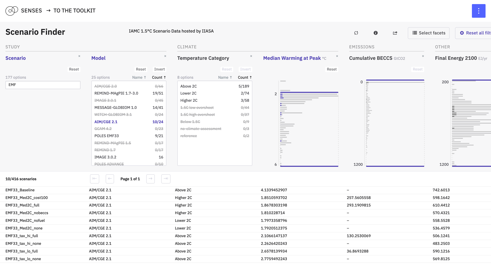
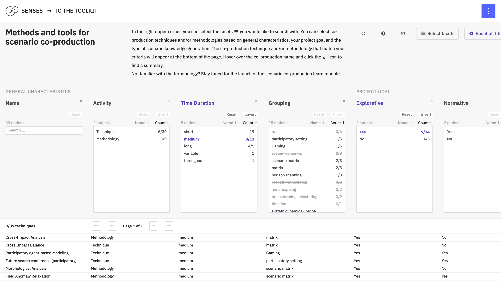

# Scenario Finder

Volker Krey and Jonas Parnow

This explore module allows you to quickly filter all avialable scenarios from the IAMC 1.5 database



# Co-production Techniques Finder

Sara Talebian, Henrik Carlsen, Nienke Ansems, Eric Kemp-Benedict and Jonas Parnow

How can we do co-production? The co-production database provides an overview of different methods and tools for specific co-production objectives.



---

This repository contains the code for [*Scenario Finder*](https://climatescenarios.org/finder/) and [*Co-production Techniques Finder*](https://climatescenarios.org/finder/techniques). They are part of the [SENSES Toolkit](https://climatescenarios.org/).

## License

The source code is licensed under the [ISC license](LICENSE.md). Text and graphics are licensed under [Attribution-ShareAlike 4.0 International](https://creativecommons.org/licenses/by-sa/4.0/). For licensing information on datasets please refer to the data sources section. Exceptions are listed below on a per-file basis.

## Structure
1. Pages use `components/Finder` as a starting point. They pass urls, titles, … to the Finder.
2. The Finder safes these information on `created`.
3. The loading of data for facets and data is started by the localStorage.

## Build Setup

``` bash
# install dependencies
$ npm install # Or yarn install

# serve with hot reload at localhost:3000
$ npm run dev

# build for production and launch server
$ npm run build
$ npm start

# generate static project
$ npm run generate
```
